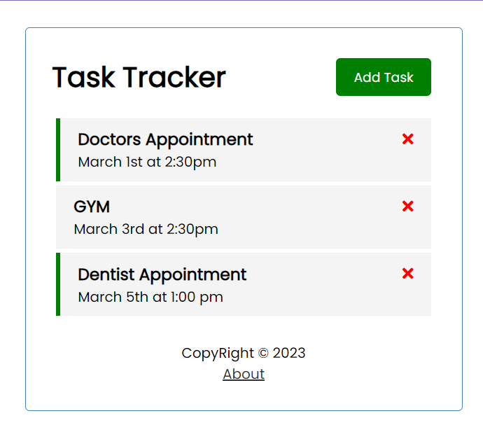

# Task-Tracker

A simple application made with Vue.js framework. It allows the user to add, delete and update the tasks.



## Project setup

```
npm install
```

### Compiles and hot-reloads for development

```
npm run serve
json-server --watch db.json --port 5000
```

### Compiles and minifies for production

```
npm run build
```

### Customize configuration

See [Configuration Reference](https://cli.vuejs.org/config/).
